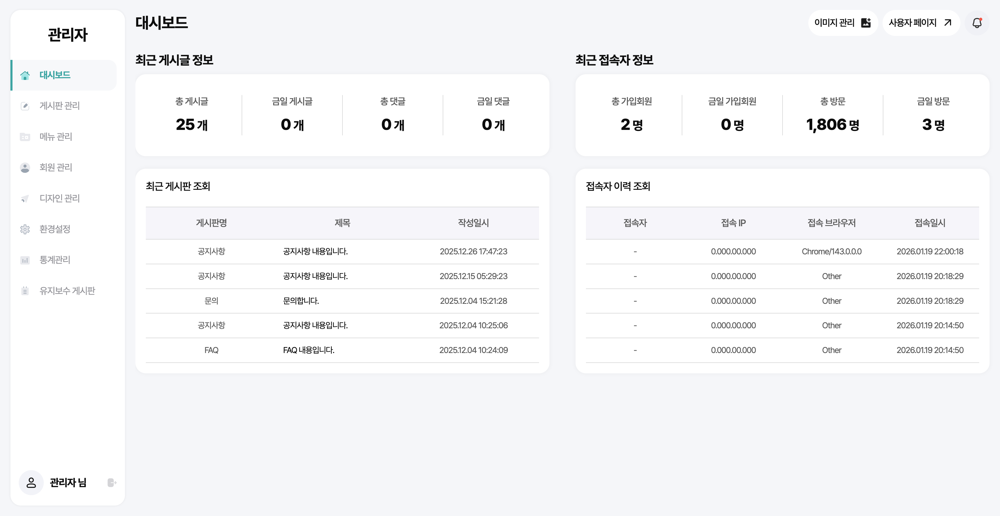
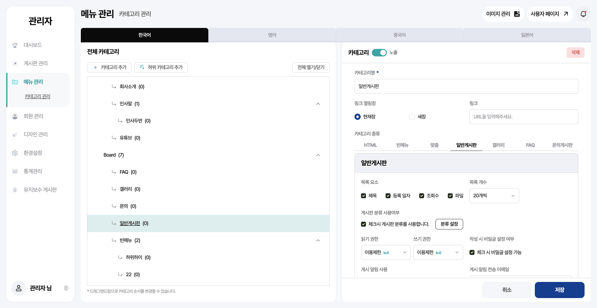

# CMS Platform Frontend

Next.js 기반의 CMS(콘텐츠 관리 시스템) 프론트엔드 프로젝트입니다.

## Tech Stack

| Category | Technology |
|----------|------------|
| Framework | Next.js 16 (App Router) |
| Language | TypeScript |
| UI Library | React 19 |
| Styling | Tailwind CSS |
| UI Components | Radix UI, Lucide Icons |
| State Management | Zustand (Client), React Query (Server) |
| Form | React Hook Form + Zod |
| Editor | Lexical |
| i18n | next-intl (ko, en, ja, zh) |
| Chart | Recharts |
| DnD | dnd-kit |
| Testing | Jest, React Testing Library |

## Features

### User Area
- 다국어 지원 (한국어, 영어, 일본어, 중국어)
- 게시판 CRUD
- 회원 인증 (로그인, 회원가입, 비밀번호 찾기)
- 메인 배너 및 팝업
- 반응형 디자인

### Admin Console
- 대시보드 (통계 차트, 최근 게시물)
- 게시판 관리 (드래그 앤 드롭 정렬)
- 메뉴/카테고리 관리 (트리 구조)
- 회원 관리
- 배너/팝업 관리
- 환경설정 (사이트 정보, 약관)
- 방문자 통계

### Editor
- Lexical 기반 리치 텍스트 에디터
- 이미지, 테이블, 코드 블록 지원
- 레이아웃 컬럼 기능
- 임베드 (YouTube 등)

## Project Structure

```
src/
├── app/                    # Next.js App Router
│   ├── (user)/            # User pages
│   └── console/           # Admin pages
├── components/
│   ├── ui/                # Base UI components (Radix)
│   ├── user/              # User area components
│   ├── console/           # Admin area components
│   └── editor/            # Lexical editor
├── service/               # API services (React Query hooks)
├── store/                 # Zustand stores
├── hooks/                 # Custom React hooks
├── types/                 # TypeScript types
├── constants/             # Constants
├── utils/                 # Utility functions
└── config/                # Configuration
```

## Getting Started

### Prerequisites

- Node.js 18+
- npm or yarn

### Installation

```bash
# Install dependencies
npm install

# Run development server
npm run dev

# Build for production
npm run build

# Start production server
npm run start
```

### Environment Variables

Create `.env.local` file:

```env
NEXT_PUBLIC_API_URL=https://your-api-url.com
NEXT_PUBLIC_API_HOSTNAME=your-api-hostname.com
NEXT_PUBLIC_SITE_ID=your-site-id
NEXT_PUBLIC_ENCRYPTION_KEY=your-encryption-key
NEXT_PUBLIC_BASE_URL=https://your-site-url.com
```

## Scripts

| Command | Description |
|---------|-------------|
| `npm run dev` | Start development server |
| `npm run build` | Build for production |
| `npm run start` | Start production server |
| `npm run lint` | Run ESLint |
| `npm run test` | Run tests |
| `npm run test:coverage` | Run tests with coverage |

## Screenshots

### Admin Console

| Dashboard | Menu/Category Management |
|-----------|--------------------------|
|  |  |

> 사용자단(User Area)은 프로젝트별 커스터마이징을 전제로 설계되어 기본 구조만 제공합니다.

## License

This project is for portfolio purposes only.
